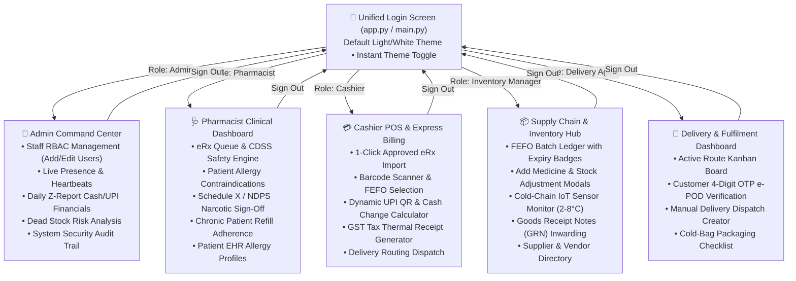

# 💊 AegisPharm Enterprise — Pharmacy Management System

[](https://www.python.org/downloads/)
[](https://github.com/TomSchimansky/CustomTkinter)
[](https://fastapi.tiangolo.com/)
[](https://www.sqlite.org/)
[](LICENSE)

An enterprise-grade, high-performance desktop pharmacy operating system engineered for retail pharmacy chains, hospital dispensaries, and clinical networks. 

Features a **clean White/Light theme by default** with a **1-click instant Dark Mode toggle**, zero-lag non-blocking asynchronous architecture, real-time staff presence heartbeats, and comprehensive enterprise functionality across **all 5 operational roles**.

---

## 🎨 Clean Dual Theming (Default: White / Light Mode)

AegisPharm features an intuitive, modern clinical UI:
- **Default Appearance**: **White / Light Mode** with clean slate borders, crisp typography, and high-readability clinical status badges.
- **Dynamic Theme Switcher**: Instant toggle button (`🌙 Dark Mode` / `☀️ Light Mode`) in both the login screen and the global top navigation bar across all dashboards.
- **Zero-Lag Architecture**: Database operations and presence telemetry run on asynchronous background threads, ensuring the UI never stutters or freezes.

---

## 🔐 Role-Based Login & Default Credentials

The application opens to a single unified **Authentication Screen**. You can log in using pre-configured staff accounts or any new staff credentials created by the Admin:

| Role | Username | Password | Assigned Dashboard & Responsibilities |
| :--- | :--- | :--- | :--- |
| **👑 Store Admin** | `admin` | `admin123` | **Admin Command Center**: Create/manage user IDs & passwords, assign roles, monitor live online staff/terminals, view daily Z-Report cash reconciliation & live audit stream. |
| **🩺 Pharmacist** | `pharmacist` | `pharma123` | **Clinical & Dispensing Station**: e-Prescription intake queue, CDSS drug interaction & patient allergy contraindication engine, Schedule X NDPS double sign-off, refill adherence, allergy EHR. |
| **💳 Cashier** | `cashier` | `cash123` | **POS & Express Billing Terminal**: 1-click import of approved prescriptions, barcode search, FEFO batch selection, split payments (Cash / Dynamic UPI QR / Card), GST invoice generator & thermal receipt printing. |
| **📦 Inventory Manager** | `inventory` | `inv123` | **Supply Chain & Inventory Hub**: Multi-batch FEFO stock ledger, low stock/expiry alerts, Goods Receipt Notes (GRN) inwarding, Cold-Chain IoT (2–8°C) telemetry & alarms, supplier directory. |
| **🚚 Delivery Agent** | `delivery` | `deliv123` | **Delivery & Logistics App**: Active dispatch Kanban board, cold-bag packaging checks, manual route dispatch, and customer 4-digit OTP digital proof-of-delivery (e-POD). |

---

## 🏗️ System Architecture & Dynamic Dashboard Routing



---

## 🌟 Comprehensive Features by Module

### 1. 🩺 Pharmacist Clinical Station
- **e-Prescription Intake Queue**: Review incoming doctor prescriptions, patient details, and medication dosages.
- **CDSS Safety Engine**: Real-time automated cross-checks against patient allergy records (e.g., Penicillin flags) and drug-drug interactions.
- **Schedule X / NDPS Narcotic Register**: Mandatory double-sign compliance modal with Pharmacist PIN authentication and Doctor DMC registration number logging, plus CSV export for regulatory drug inspectors.
- **Chronic Patient Refill Adherence**: Track patient refill schedules, overdue flags, and 1-click WhatsApp/SMS refill reminder simulations.
- **Patient EHR Profiles**: Comprehensive allergy records, chronic conditions, and patient registration intake modal.

### 2. 💳 Cashier POS & Billing Terminal
- **1-Click eRx Import**: Instantly pull approved prescriptions from the pharmacist queue into the POS cart without manual re-entry.
- **FEFO Batch Auto-Selection**: First-Expiry, First-Out batch picking guarantees dispensing nearest-expiry batches first.
- **Multi-Tender Payments**:
  - **Cash**: Automated cash tendered and change return calculation.
  - **Dynamic UPI QR**: Interactive modal with dynamic UPI payment string and simulation timer.
  - **Card**: Credit/Debit terminal authorization simulation.
- **GST Tax Invoice & Thermal Receipt**: Instant 80mm thermal receipt generator modal with print and export capabilities.
- **Home Delivery Dispatch Routing**: Checkbox to route orders directly to the Delivery Fleet dispatch board upon checkout.

### 3. 📦 Inventory & Supply Chain Hub
- **Multi-Batch FEFO Ledger**: Real-time batch inventory tracking with color-coded expiry badges (`Expired`, `Critical < 30d`, `Attention < 90d`, `Good`) and stock adjustments.
- **Add Medicine Modal**: SKU, generic name, category, Schedule classification (H1/X/OTC), manufacturer, rack location, and cold-chain flags.
- **Goods Receipt Notes (GRN)**: Inward supplier shipments with PO number, supplier selection, received quantity, batch number, expiry date, and unit cost.
- **Cold-Chain IoT Monitor**: Live circular temperature gauge, 24-hour telemetry log stream, and simulated temperature spike alarms (`ALERT: Exceeded 8.0°C`).
- **Suppliers Directory**: Manage distributors, contact persons, phone numbers, and payment terms.

### 4. 🚚 Delivery Fleet & Logistics
- **Active Route Board**: Kanban columns for `Packaging`, `Out for Delivery`, and `Delivered`.
- **Electronic Proof of Delivery (e-POD)**: 4-digit customer OTP verification modal ensuring secure handoff of medicines.
- **Manual Task Dispatch**: Create ad-hoc delivery tasks with customer address, phone number, and special delivery notes.
- **Cold-Bag Telemetry**: Tagging cold-chain packages to ensure thermal transport compliance.

### 5. 👑 Enterprise Admin Command Center
- **Staff User Management & RBAC**: Create new staff accounts, assign roles, edit passwords, or toggle account status (`Active` / `Suspended`).
- **Live Online Presence**: Non-blocking heartbeat monitor tracking currently active terminals, login timestamps, and active user tasks.
- **Daily Financial Z-Report**: Real-time reconciliation of daily gross revenue, payment method breakdowns (Cash vs UPI vs Card), and CGST/SGST tax liabilities.
- **Dead Stock & Movement Analytics**: Fast-moving inventory analysis vs stagnant capital risks.
- **System Audit Trail**: Complete immutable event stream recording every prescription approval, POS transaction, stock adjustment, and user authentication.

---

## 🚀 Getting Started

### 1. Prerequisites
- Python 3.10 or higher.

### 2. Clone Repository & Install Dependencies
```bash
git clone https://github.com/Piyush7251/Pharmacy_Management_System.git
cd Pharmacy_Management_System

# Install dependencies
pip install customtkinter pillow requests
```

---

## 🖥️ Running the Application

### Option A: Unified Application (Recommended)
Launches the single unified application with authentication and dynamic role dashboard loading:
```bash
python main.py
# or
python app.py
```

### Option B: Dedicated Standalone Terminals
Each station can also be launched directly as a standalone kiosk for dedicated multi-terminal setups:
```bash
# Pharmacist Station
python apps/pharmacist_app.py

# Cashier POS Billing Terminal
python apps/cashier_app.py

# Inventory & Supply Chain Hub
python apps/inventory_app.py

# Delivery Logistics Fleet
python apps/delivery_app.py

# Admin Command Center
python apps/admin_app.py
```

---

## 📂 Project Structure

```
Pharmacy_Management_System/
├── README.md                      # Comprehensive System Documentation
├── main.py                        # Unified Application Entry Point
├── app.py                         # Application Window & Role-Based Router
├── apps/                          # Dedicated Standalone Terminal Launchers
│   ├── admin_app.py               # Standalone Admin Command Center
│   ├── cashier_app.py             # Standalone Cashier POS Terminal
│   ├── delivery_app.py            # Standalone Delivery Fleet Terminal
│   ├── inventory_app.py           # Standalone Inventory Hub Terminal
│   └── pharmacist_app.py          # Standalone Pharmacist Clinical Station
├── core/                          # Data, Security & Network Layer
│   ├── api_client.py              # Asynchronous Presence Heartbeat & Event Logger
│   └── db.py                      # SQLite Central State Engine & Relational CRUD Layer
├── ui/                            # Shared UI Theme & Dashboard Views
│   ├── theme.py                   # Light (Default White) & Dark Color Tokens
│   └── views/                     # Full-Featured Role Dashboard Views
│       ├── login_view.py          # Unified Authentication Screen
│       ├── admin_dashboard_view.py      # Admin Command Center & Staff Management
│       ├── pharmacist_dashboard_view.py # Pharmacist Clinical & CDSS Station
│       ├── cashier_dashboard_view.py    # Cashier POS & Billing Terminal
│       ├── inventory_dashboard_view.py  # Inventory & FEFO Batch Ledger
│       └── delivery_dashboard_view.py   # Delivery Dispatch & e-POD App
├── server/                        # Optional Central Cloud/Network Gateway
│   └── gateway_server.py          # FastAPI Gateway Server & REST Endpoints
└── data/                          # Seed Datasets
    └── mock_db.py                 # Initial medicines, patients, and batch data
```

---

## 📄 License
This project is open-source and licensed under the [MIT License](LICENSE).
