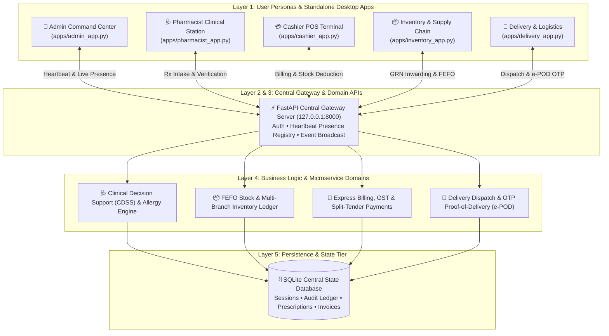

# 💊 AegisPharm Enterprise — Distributed Pharmacy Management System

[](https://www.python.org/downloads/)
[](https://github.com/TomSchimansky/CustomTkinter)
[](https://fastapi.tiangolo.com/)
[](https://www.sqlite.org/)
[](LICENSE)

An enterprise-grade, distributed desktop ecosystem for modern pharmacy chains, hospital dispensaries, and retail pharmacies. Built following a **6-layer microservice-inspired architecture**, AegisPharm provides role-dedicated desktop applications connected via a **Central Gateway Server with real-time Online Presence & Heartbeat Monitoring**.

---

## 🏗️ 6-Layer Distributed System Architecture



---

## 📱 Dedicated Standalone Desktop Applications

AegisPharm provides individual, specialized desktop applications tailored for each operational role:

| Application | Role / Persona | Key Features |
| :--- | :--- | :--- |
| **👑 Admin Command Center** | Store Admin / Owner | • **Live Online Staff Monitor**: Real-time heartbeat tracking showing who is online, terminal IPs, and current actions.<br/>• **Live Event Audit Stream**: Instant ticker of billing, prescription approvals, and deliveries across all terminals.<br/>• **Storewide KPIs**: Gross sales turnover, critical stock alerts, and dispatch counts. |
| **🩺 Pharmacist Station** | Registered Pharmacist | • **eRx Intake Queue**: Incoming digital prescriptions with doctor & clinic details.<br/>• **CDSS Clinical Safety Engine**: Automatic drug allergy contraindication alerts (e.g. Amoxicillin vs Penicillin allergy).<br/>• **Schedule X Double-Sign**: Narcotic sign-off with Pharmacist registration and PIN. |
| **💳 Cashier POS Terminal** | Cashier / POS Operator | • **Express Counter Checkout**: Instant barcode scanning and drug search.<br/>• **GST Invoicing & Split-Tender Payments**: UPI / Dynamic QR, Cash, and Card payments.<br/>• **Instant Stock Deduction**: Real-time inventory sync upon billing. |
| **📦 Inventory & Supply Hub** | Warehouse / Inventory Mgr | • **FEFO Batch Management**: Priority sorting by earliest expiration dates.<br/>• **Cold-Chain Sensor Integrity**: Monitoring temperature-sensitive drugs (2–8°C).<br/>• **Goods Receipt Notes (GRN)**: Inwarding shipments and adjusting reorder thresholds. |
| **🛵 Delivery & Logistics App** | Delivery Partner / Rider | • **Active Route Dispatches**: Customer address, cold-pack verification, and delivery time slots.<br/>• **e-POD with OTP**: Customer 4-digit OTP verification for instant delivery reconciliation. |

---

## 🚀 Getting Started

### 1. Prerequisites
Ensure you have Python 3.10+ installed on your system.

### 2. Clone Repository & Install Dependencies
```bash
git clone https://github.com/Piyush7251/Pharmacy_Management_System.git
cd Pharmacy_Management_System

# Install required Python packages
pip install customtkinter fastapi uvicorn requests darkdetect pillow
```

---

## 🎛️ Running the System

### Option A: Launch the Master Control Hub (Recommended)
Launch the master portal to automatically start the Central Gateway Server and open any or all client apps with one click:

```bash
python main_launcher.py
```

### Option B: Launch Specific Applications Individually
You can run any application independently in its own separate desktop window:

```bash
# 1. Admin Command Center (with live staff presence monitor)
python apps/admin_app.py

# 2. Pharmacist Clinical Station
python apps/pharmacist_app.py

# 3. Cashier POS Terminal
python apps/cashier_app.py

# 4. Inventory & Supply Chain Hub
python apps/inventory_app.py

# 5. Delivery & Logistics App
python apps/delivery_app.py

# 6. Central Gateway Server (optional standalone)
python server/gateway_server.py
```

---

## 📂 Project Structure

```
Pharmacy_Management_System/
├── README.md                      # Comprehensive Project Documentation
├── main_launcher.py               # Master Control Hub & Multi-App Launcher
├── apps/                          # Standalone Role-Based Desktop Applications
│   ├── admin_app.py               # Admin Command Center & Online Staff Monitor
│   ├── pharmacist_app.py          # Pharmacist Clinical & Dispensing Station
│   ├── cashier_app.py             # Cashier Express POS & Billing Terminal
│   ├── inventory_app.py           # Inventory & Supply Chain FEFO Hub
│   └── delivery_app.py            # Fulfilment & Delivery Logistics App
├── core/                          # Core Data & Networking Layer
│   ├── api_client.py              # Presence Connector & Background Heartbeat Engine
│   └── db.py                      # SQLite Central State Database & Initializer
├── server/                        # Backend Microservices & API Gateway
│   └── gateway_server.py          # FastAPI Gateway Server & REST/Presence Endpoints
├── ui/                            # Shared UI Design Tokens & Theme Engine
│   ├── theme.py                   # High-contrast clinical dark theme & typography
│   └── views/                     # Modular component views
├── data/                          # Seed Datasets
│   └── mock_db.py                 # Initial medicines catalog, patients, and batches
└── pharmacy-architecture/         # Interactive System Architecture Visualizer (Web)
    ├── index.html                 # Interactive 6-layer architecture graph
    └── original_script.js         # Visualizer rendering and simulation scripts
```

---

## 🛡️ Clinical Decision Support System (CDSS)

AegisPharm includes built-in clinical safety rules:
- **Allergy Contraindications**: Cross-references patient allergy profiles against prescribed drug chemical entities (e.g., Penicillin cross-reactivity).
- **Drug-Drug Interactions**: Real-time warnings when co-prescribed medications pose pharmacological interaction risks.
- **Narcotic / Schedule X Controls**: Mandatory 2-step pharmacist double-sign and PIN authorization to prevent unauthorized dispensing.

---

## 📄 License
This project is open-source and licensed under the [MIT License](LICENSE).
