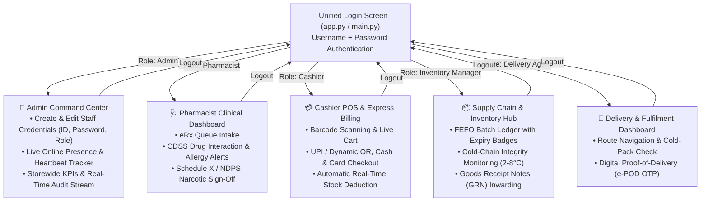

# 💊 AegisPharm Enterprise — Pharmacy Management System

[](https://www.python.org/downloads/)
[](https://github.com/TomSchimansky/CustomTkinter)
[](https://fastapi.tiangolo.com/)
[](https://www.sqlite.org/)
[](LICENSE)

An enterprise-grade, role-based desktop application for modern pharmacy chains, hospital dispensaries, and retail pharmacies. Built with **Role-Based Access Control (RBAC)**: Users authenticate with their assigned **User ID & Password**, and the system dynamically loads their dedicated role dashboard.

---

## 🔐 Role-Based Login & Credentials

The application opens to a single unified **Authentication Screen**. You can log in using pre-configured staff accounts or any new staff credentials created by the Admin:

| Role | Username | Password | Assigned Dashboard & Responsibilities |
| :--- | :--- | :--- | :--- |
| **👑 Store Admin** | `admin` | `admin123` | **Admin Command Center**: Create/manage user IDs & passwords, assign roles, monitor live online staff/terminals, view storewide KPIs & audit stream. |
| **🩺 Pharmacist** | `pharmacist` | `pharma123` | **Clinical & Dispensing Station**: e-Prescription intake queue, CDSS drug interaction & patient allergy contraindication engine, Schedule X double sign-off. |
| **💳 Cashier** | `cashier` | `cash123` | **POS & Express Billing Terminal**: Fast barcode search, cart calculations, GST breakdown, split-tender payments (UPI/Cash/Card), stock deduction. |
| **📦 Inventory Manager** | `inventory` | `inv123` | **Supply Chain & Inventory Hub**: Multi-batch FEFO (First-Expired, First-Out) ledger, cold-chain monitoring (2–8°C), Goods Receipt Notes (GRN). |
| **🛵 Delivery Agent** | `delivery` | `deliv123` | **Delivery & Logistics App**: Active home delivery routes, cold-chain packaging checks, and customer 4-digit OTP digital proof-of-delivery (e-POD). |

---

## 🏗️ System Architecture & Dynamic Dashboard Routing



---

## 👥 Admin Staff Management Features

In the **Admin Dashboard**, the Admin user has full control over user credentials and permissions:
1. **Create New User**: Specify Staff ID, Full Name, Role, Username, Password, Email, Phone, and Branch.
2. **Edit Credentials**: Update existing user passwords, roles, or toggle account status (`Active` / `Suspended`).
3. **Live Online Presence Monitor**: Real-time heartbeat tracker showing who is currently logged in, terminal hostnames, IP addresses, and active tasks.
4. **Audit Log & Activity Stream**: Real-time event ticker of all prescription verifications, billing receipts, and deliveries across all staff.

---

## 🚀 Getting Started

### 1. Prerequisites
Ensure you have Python 3.10+ installed.

### 2. Clone Repository & Install Dependencies
```bash
git clone https://github.com/Piyush7251/Pharmacy_Management_System.git
cd Pharmacy_Management_System

# Install required packages
pip install customtkinter fastapi uvicorn requests darkdetect pillow
```

---

## 🖥️ Running the Application

To launch the unified desktop application, run:

```bash
python main.py
# or
python app.py
```

1. Enter your **Username** and **Password** (or click one of the quick demo buttons).
2. The application will authenticate and load your **personalized role dashboard**.
3. To switch users, click **"Sign Out"** in the top-right corner.

---

## 📂 Project Structure

```
Pharmacy_Management_System/
├── README.md                      # Complete Project Documentation
├── main.py                        # Unified Application Entry Point
├── app.py                         # Application Window & Role-Based Router
├── core/                          # Data & Network Layer
│   ├── api_client.py              # Presence Heartbeat & Event Logger
│   └── db.py                      # SQLite Central State Database & User Auth CRUD
├── ui/                            # Shared UI Theme & Dashboard Views
│   ├── theme.py                   # High-contrast dark clinical theme & typography
│   └── views/                     # Role-Specific Dashboard Views
│       ├── login_view.py          # Unified Authentication Screen
│       ├── admin_dashboard_view.py      # Admin Command Center & Staff Management
│       ├── pharmacist_dashboard_view.py # Pharmacist Clinical & CDSS Station
│       ├── cashier_dashboard_view.py    # Cashier POS & Billing Terminal
│       ├── inventory_dashboard_view.py  # Inventory & FEFO Batch Ledger
│       └── delivery_dashboard_view.py   # Delivery Dispatch & e-POD App
├── server/                        # Backend Microservices
│   └── gateway_server.py          # FastAPI Gateway Server & REST Endpoints
└── data/                          # Seed Datasets
    └── mock_db.py                 # Initial medicines, patients, and batch data
```

---

## 📄 License
This project is open-source and licensed under the [MIT License](LICENSE).
